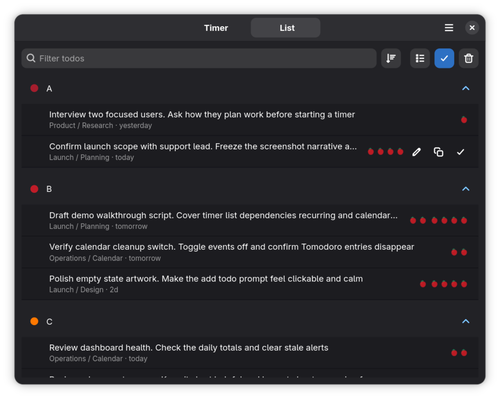
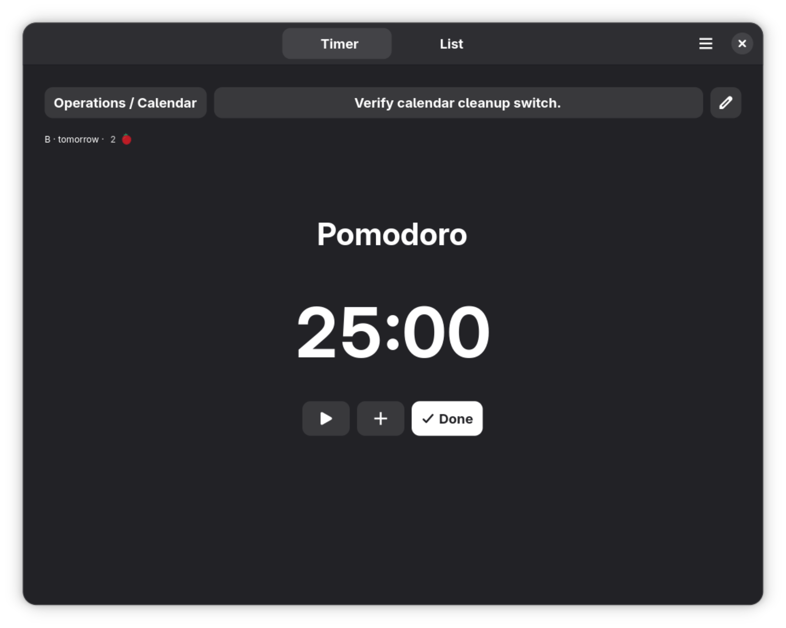
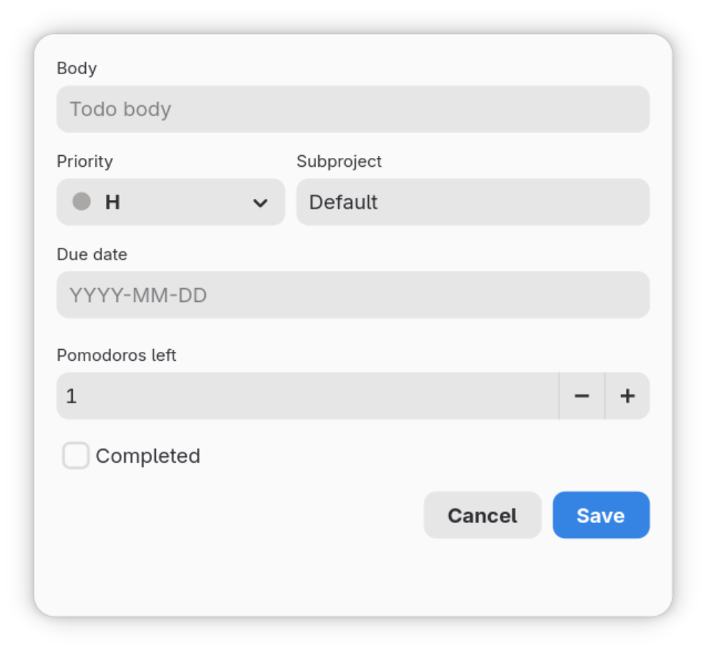

# Tomodoro

Todo + Pomodoro = Tomodoro.

Tomodoro combines a `todo.txt` task list with a Pomodoro timer. It is for people who want to plan what needs to be done, choose one task, and track how much focused work is still left.

Most todo apps manage tasks. Most Pomodoro apps run timers. Tomodoro connects both: each todo can have remaining pomodoros, so the list shows not only what is pending, but also the effort still needed.

Tomodoro is built for practical daily use and is actively maintained from real usage.

## Features

- Context-specific `todo.txt` files
- Projects and subprojects
- Priorities, due dates, and completed tasks
- Pomodoro timer tied to the selected todo
- Remaining pomodoros shown in the list and timer
- Task dependencies and nested task views
- Recurring task templates
- Optional GNOME Calendar event integration
- Desktop notifications
- App indicator menu for quick access
- Plain text storage under `~/contexts`

## Screenshots







## Planned Improvements

- More polished timer UI
- Pomodoro statistics for recent days
- Better notifications
- Better app indicator/system tray behavior
- More UI refinements based on real usage

Feature requests and bug reports are welcome. If a workflow is useful and fits the app, it can be discussed and improved over time.

## Install Locally

This repository includes a local Flatpak installer used during development:

```bash
scripts/todo-pomodoro-flatpak-install
```

Run the installed app:

```bash
flatpak run io.github.samet_mohamedamin.Tomodoro
```

## Build From Source

```bash
meson setup build
meson compile -C build
./build/src/tomodoro
```

## License

Tomodoro is licensed under GPL-3.0-or-later.
